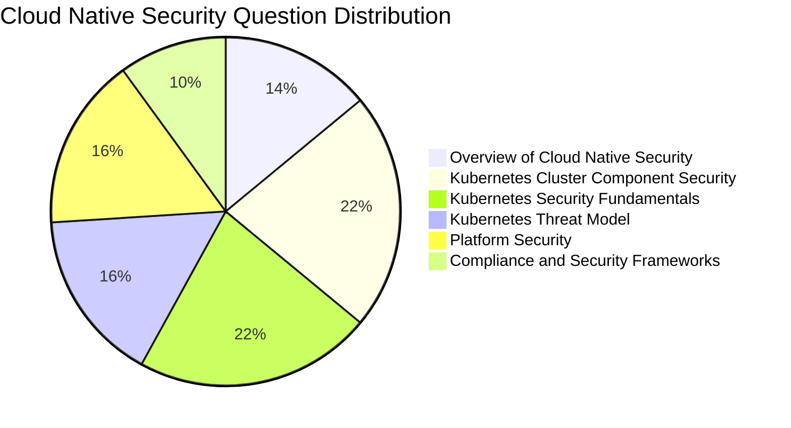

#  𝗞𝘂𝗯𝗲𝗿𝗻𝗲𝘁𝗲𝘀 𝗮𝗻𝗱 𝗖𝗹𝗼𝘂𝗱 𝗡𝗮𝘁𝗶𝘃𝗲 𝗦𝗲𝗰𝘂𝗿𝗶𝘁𝘆 𝗔𝘀𝘀𝗼𝗰𝗶𝗮𝘁𝗲 (𝗞𝗖𝗦𝗔)

Purpose: A Certified Kubernetes and Cloud Native Security Associate is an associate-level certification designed for candidates interested in advancing to the professional level through a demonstrated understanding of foundational knowledge and skills of security technologies in the cloud native ecosystem.

  

Certification can be found at the [LF Training Portal](https://training.linuxfoundation.org/certification/kubernetes-and-cloud-native-security-associate-kcsa/).

# Facts about KCSA

- Cost - 250.00 USD ( Discounts are available through Linux Foundation programs such as [LIFT Scholarship](https://www.linuxfoundation.org/about/lift-scholarships) + KubeCon Attendee Vouchers, and Black Friday Sales.)
- Certification Valid for 3 Years
- Includes 12 Month Exam Eligibility
- One Retake if you didn't PASS
- Multiple Choice Exam ( 60 Questions ) 
- Duration of Exam 90 minutes
- Passing Marks - 75 / Total Marks - 100 or 45/60 Questions should be correct
- During the exam, you can access Notepad/Calculator in the PSI Secure browser, but it is not required for this exam.
- Exams are scored automatically and barring any exceptions or technical difficulties, a score report will be emailed to you, within 24 hours of completing the exam. ( **Note:** I got mine in 2 mins after exam completion ) 

# Weightage of Different Topics

# Resources in Details 
Following a section-wise approach for the exam helps. You can start from the top and go to the bottom to cover the syllabus: 

## 🐳 𝗖𝗹𝗼𝘂𝗱 𝗡𝗮𝘁𝗶𝘃𝗲 𝗦𝗲𝗰𝘂𝗿𝗶𝘁𝘆

→ Container image scanning (eg: [trivy](https://github.com/aquasecurity/trivy) ) 

→[ Multi-stage Docker builds](https://docs.docker.com/build/building/multi-stage/)

→ Container registries

→ [gVisor](https://gvisor.dev/docs/)/[Firecracker](https://firecracker-microvm.github.io/) ( Mostly a CKS topic, but important) 

→ Image signing ( [cosign](https://github.com/sigstore/cosign) )

→ [Image Digest vs Image tags](https://candrews.integralblue.com/2023/09/always-use-docker-image-digests/)

→ Container breakout prevention

→ [CWPP (Cloud Workload Protection Platform)](https://www.microsoft.com/en-in/security/business/security-101/what-is-cwpp)

→ Multi-tenancy models (Soft vs Hard)

→ Docker socket security

-> 4 Cs of CN Security ( Cloud, Cluster, Container, Code ) 

## 📊 𝗖𝗼𝗺𝗽𝗹𝗶𝗮𝗻𝗰𝗲 𝗮𝗻𝗱 𝗦𝗲𝗰𝘂𝗿𝗶𝘁𝘆 𝗙𝗿𝗮𝗺𝗲𝘄𝗼𝗿𝗸𝘀

→ NIST Cybersecurity Framework

→ NIST SP 800-53 Rev.5

→ FedRAMP

→ HIPAA

→ CIS Controls

→ CIS Kubernetes Benchmark (with kube-bench)

→ Microsoft SDL

→ NSA/CISA guidance

→ MITRE ATT&CK

→ OPA Gatekeeper

→ Kyverno

## ⚙️ 𝗞𝘂𝗯𝗲𝗿𝗻𝗲𝘁𝗲𝘀 𝗖𝗹𝘂𝘀𝘁𝗲𝗿 𝗖𝗼𝗺𝗽𝗼𝗻𝗲𝗻𝘁 𝗦𝗲𝗰𝘂𝗿𝗶𝘁𝘆

→ kube-apiserver configuration ( diff flags for diff controllers) 

→ etcd encryption

→ kubelet security

→ kube-scheduler

→ kube-proxy

→ Static pods

→ Cluster health checks

→ Services (ClusterIP/NodePort/LoadBalancer)

→ Ingress

→ PersistentVolumes

→ StatefulSets

→ DaemonSets

→ HPA (Horizontal Pod Autoscaler)

→ kubeadm auth vs authorize controls

## 🔐 𝗞𝘂𝗯𝗲𝗿𝗻𝗲𝘁𝗲𝘀 𝗦𝗲𝗰𝘂𝗿𝗶𝘁𝘆 𝗙𝘂𝗻𝗱𝗮𝗺𝗲𝗻𝘁𝗮𝗹𝘀

→ RBAC (Roles/RoleBindings + ClusterRole/ClusterRoleBindings) 

→ Security contexts

→ Pod Security Standards/PSA

→ Pod Security Policies (Deprecated + comparison with PSA )  

→ NetworkPolicies

→ Secrets vs ConfigMaps

→ ServiceAccounts

→ Namespaces

→ Admission controllers

→ Audit policies

→ Image pull policies

→ Certificate management

## 🎯 𝗞𝘂𝗯𝗲𝗿𝗻𝗲𝘁𝗲𝘀 𝗧𝗵𝗿𝗲𝗮𝘁 𝗠𝗼𝗱𝗲𝗹

→ STRIDE framework

→ Threat modeling process +  Threat modeling  b/w k8s components like API-Server and CNI

→ Privilege escalation

→ Information disclosure

→ Tampering/spoofing

→ Denial of service

→ Elevation of privileges

→ Trust boundaries

→ Attack persistence

## 🖥️ 𝗣𝗹𝗮𝘁𝗳𝗼𝗿𝗺 𝗦𝗲𝗰𝘂𝗿𝗶𝘁𝘆

→ Linux tools (strace, netstat)

→ Certificate management (OpenSSL)

→ TLS/SSH

→ kubectl commands

→ Service Mesh ( mTLS ) 

→ AppArmor

→ PKI (Public Key Infrastructure)

→ File integrity

→ Package management

→ Network diagnostics

→ Monitoring tools (Grafana)

# Resources
- [KodeKloud KCSA](https://learn.kodekloud.com/user/courses/kubernetes-and-cloud-native-security-associate-kcsa)

# Study Tips
- Play with the tools like ArgoCD a bit to understand them clearly
- Focus on implementing and running a simple GitOps Application for Clarity
- Learn a bit of Architecture of the Tools as it helps you remember theory for longer

# Exam Tips ( PSI ) 
- Keep your desk tidy and run the System Check before the exams.
-  Carry an ID that has not expired.
- The exam can be started 30 minutes prior to your scheduled time, which is an excellent opportunity to complete the security checks and begin the exam early. It helps me to calm down and not rush during the exam :) 
- Delete the PSI Browser from your system to save time for your next exam. 
- Mark the questions `To Review` if you need more clarification and want to get back later. You have a dashboard with all the questions collectively listed, which helps you to get back to easily
  
# Certificate and a Credly Badge
Once you PASS it, you get the certificate mailed to you ⬇️

With that, you can move on to the next certification from the catalogue and don't forget to Star ⭐ this repo. Feel free to contribute any resource, that was helpful to you! 

